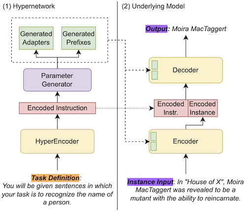

# Hyper-Task-Descriptions

Official repository for the paper [HINT: Hypernetwork Instruction Tuning for Efficient Few- and Zero-Shot Generalisation](https://arxiv.org/abs/2212.10315). We introduce a model that learns to generate adaptation parameters from instructions, allowing greatly improved inference efficiency while retaining performance. We find the model is especially effective in few-shot scenarios. The overall architecture looks like:



This codebase is based on [t5x](https://github.com/google-research/t5x) and has only been tested on TPUs.

If you find our paper or model useful please cite us:
```
@article{hint,
  author = {Hamish Ivison and Bhagia, Akshita and Wang, Yizhong and Hajishirzi, Hannaneh and Peters, Matthew},
  title = {HINT: Hypernetwork Instruction Tuning for Efficient Zero-Shot Generalisation},
  journal = {ACL},
  url = {https://arxiv.org/abs/2212.10315},
  year = {2023}
}
```

## Setup

As this runs on t5x, you'll need a gcloud bucket you can write and read from. I recommend this bucket is in the same region as your TPUs to avoid large ingress/egress costs.

I also recommend reading the [T5X documentation](https://github.com/google-research/t5x/tree/main/docs) before working with this repo. I will assume some familiarity with `gin`, `seqio`, etc. for the rest of this readme. If you have never worked with TPUs before, reading the TPU guide at the bottom of this readme is a good idea!

### Local Installation

`pip install -e .[dev]` should to install basic dependencies. Note there's some annoyances with `seqio`: please uninstall `seqio` and `seqio-nightly` (which are probably installed by the above) and install install my fork: `https://github.com/hamishivi/seqio`, which contains a fix.

Some artefacts are used during training that might be useful to cache ahead of time. You can cache these as follows:
- Tokenizers: ```python3 -c "from transformers import AutoTokenizer; AutoTokenizer.from_pretrained('t5-base'); AutoTokenizer.from_pretrained('roberta-base')"```
- Roberta model: ```python3 -c "from transformers import FlaxRobertaModel; FlaxRobertaModel.from_pretrained('hamishivi/fixed-roberta-base')"```
- Data splits (only do if you want to run with all datasets): ```TRANSFORMERS_OFFLINE=1 python3 -c "import hyper_task_descriptions.seqio_tasks.all_t0_tasks"```

See `scripts/tpu_setup.sh` for an example of setting up this codebase to run on a TPU. Local installation should be similar minus the TPU-specific Jax version.

Run `scripts/local/local.sh` for a small model + small subset of T0 data that is useful for local development.

## Data Preprocessing

Due to the large size of P3, I recommend preprocessing data before training. You can do this with `seqio_cache_tasks` as such:


```bash
seqio_cache_tasks \
      --tasks="<task regex>" \
      --output_cache_dir=gs://<output bucket folder> \
      --module_import=hyper_task_descriptions.seqio_tasks.my_t0_tasks \
      --min_shards 1 \
      --alsologtostderr
```

Check out [seqio](https://github.com/google/seqio) for more on this tool. Some notes for this repo:
- Run this on a machine with a lot of RAM, as it can be quite memory-hungry when preprocessing some of the larger T0 tasks.
- I found using 1 process per P3 prompt/task worked best, as trying to do all the tasks at once was very slow.
- For processing pretraining data such as C4, it might be useful to try and use [google dataflow](https://cloud.google.com/dataflow) instead. Unfortunately, I don't have the commands I used for preprocessing C4 with dataflow around anymore.


## Model Training

Once your data is preprocessed and ready to go, you can train! We manage our configs with `gin` and commands for training can be found in `scripts`. To replicate the HINT model:
- Run `pretraining/pretrain.sh`.
- Run `train_from_t5.sh`, but replace the value of `INITIAL_CHECKPOINT_PATH` with the model you just pretrained.

While we have many `gin` configs, I will highlight the most important ones:
- `hyper_<size>.gin` defines the HINT model, with various sizes available (the same sizes as T5 models).
- `instruction_embed.gin` defines how the instructions are coded into the underlying model following HINT. We experimented with many different methods of doing this (lora, adapters, prefixes, prompts...) which are all separably configurable!
- `partial_train_adafactor_dual.gin` defines the adafactor optimizer, and sets the values for the hypernetwork and underlying t5 so that we use the existing optimizer state for the T5 model, but correctly initialize the hypernetwork optimizer states. We use this for pretraining and finetuning.
- `pretrain.gin` defines the pretraining mixture and settings (input/output lengths, etc).
- `t0_train.gin` defines the mixture and settings for training on P3 (T0 train set).
- `ni_train.gin` defines the mixture and settings for training on Super-Natural Instructions.

## Evaluation

## TPU Guide

This was my first project working with TPUs, so below is the steps I worked out while using them. If you are experienced with TPU pods you probably don't need to read this.

### TPU installation

See below for instructions on setting up and running on TPUs. Run `scripts/tpu_setup.sh` to setup the TPU. Note this takes ~30min to run (the T0 tasks require download split information for all datasets, which takes some time).

### Running on the TPU

Running on TPU slices is a bit of a pain as you cannot 'just ssh to the machine and run stuff directly'. Rather, you send commands to all the TPUs, and Jax/Flax/t5x works it all out for you in the background. Here's a rough guide of useful steps for setting up and running directly on a TPU.

First, create your tpu! I'll leave aside some of the details but you can do this with a command like:
```
gcloud alpha compute tpus tpu-vm create <name> --accelerator-type=<tpu-version> --zone=<zone> --project=<project> --version=<software-version>
```

You can get some details on TPU architectures [here](https://cloud.google.com/tpu/docs/system-architecture-tpu-vm) and software versions [here](https://cloud.google.com/tpu/docs/supported-tpu-versions). Note that the software version shouldn't matter that much for us, since we're using `jax`.

Next, we need to setup our tpu. Note that if you're using a single TPU (i.e. a `v3-8`), you can ssh directly to the TPU vm with `gcloud alpha compute tpus tpu-vm ssh <tpu-name> --zone=<zone> --project=<project>` and do all your setup directly on the box. However, anything larger requires managing multiple machines and sending shell commands using a command like `gcloud alpha compute tpus tpu-vm ssh <tpu-name> --zone=<zone> --project=<project> --worker=all --command="<bash commands>"`. If even one machine fails when you run the command, try again - you need them all basically to be setup the same way. Please **run all the below commands in place of `<bash commands>` if you are running on a TPU slice**. Otherwise, just ssh'ing directly into the TPU should work fine.

To setup our TPUs, just clone this repo and run `scripts/tpu_setup.sh` as such: 
```bash
git clone https://github.com/allenai/hyper-task-descriptions.git; ./hyper-task-descriptions/scripts/tpu_setup.sh
```
Refer to comments in that script in case something fails (although fingers crossed nothing does!). Note that this is currently a private repo so you'll probably have to use a github authentication token and alter the url accordingly.

Then we can run our model with the following:
```bash
cd hyper-task-descriptions; ./scripts/<script-name>
```
This will run the given script on all TPUs. Note this will run the script on all TPUs at once, so you will see a lot of output being logged. If one TPU errors the rest will continue to run, so cancel the command (control+C) and **before rerunning follow the cleanup steps below**.

`scripts/t0_train.sh` is for training a model and `scripts/t0_eval.sh` for evaluating. I recommend looking at those scripts and the accompanying T5X commands (tain/eval) to understand the options.

To deal with long-running jobs, where you don't want to have your computer constantly connected with the TPU, I tended to just run the process in the background and log all output:
```bash
cd hyper-task-descriptions; ./scripts/<script-name> &> log.log &
```
However, there are probably also other solutions that work well too!

### TPU Troubleshooting

#### Rerunning

When rerunning code on the TPUs, you need to make sure there are no processes using a core on *any* TPU, otherwise things wont work (your code will run on CPU). A useful one-liner for finding and killing TPU-using processes is:
```bash
sudo lsof -t /dev/accel0 | xargs kill -9
```

Sometimes there can be random lockfiles that hold TPUs too if you aborted a Jax program early (see [here](https://github.com/google/jax/issues/10192)). Remove them with 
```bash
sudo rm -f /tmp/libtpu_lockfile; sudo rm -rf /tmp/tpu_logs
```
Note I haven't had to run this step.

#### Altering scripts / code

Sometimes you might want to run or hotfix some script or file in this repo after scaling up to multiple TPUs. To do so, after everything is setup, create the new/edited file locally. Then copy it over to the TPUs with:
```bash
gcloud alpha compute tpus tpu-vm scp <new-file>  <tpu-name>: --zone=<zone> --project=<project> --worker=all
```
You might be able to specify the destination path after <tpu-name> but it didn't work when I tried it. Instead, I just use a `mv` command to move the file where it should go.

**Note: you might get weird `ssh` errors when running the above `scp` command.** If you do, run `ssh-add .../.ssh/google_compute_engine` like the error probably suggests and rerun the command right after. Sometimes this takes a few tries before it runs without error, although so long as the new file ends up on all TPUs you're good to go.

After moving the file to where it should go, you're done! Run the script or rerun your model or whatever you need to do. **Alternatively, I also recommend just setting up a git branch and using `git pull` to update scripts**, since 'scp-ing' and managing multiple filesystems at once can be a pain.
